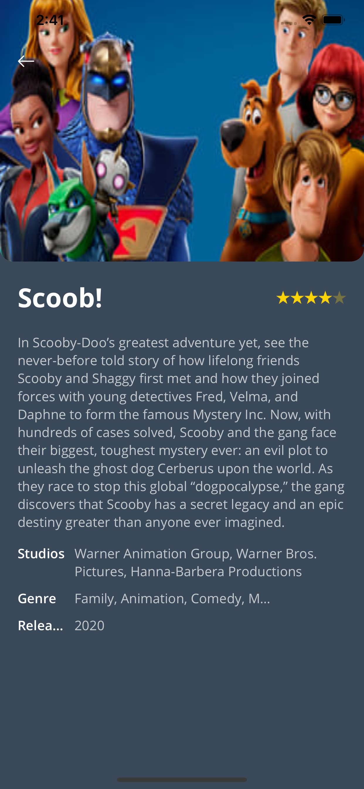
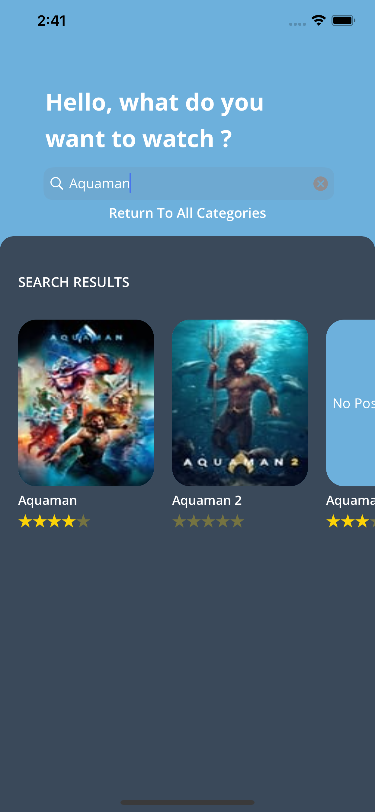

MovieDB
=======

A movie app that you can use to discover what is playing right now at the cinemas and search for details of your favorite movie

  
   
  

#  How to run
No dependency is required here! Just clone the repo, open and run it with Xcode.
